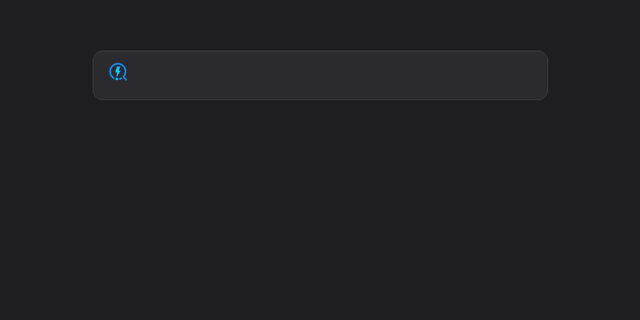
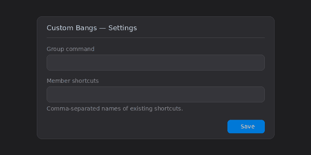
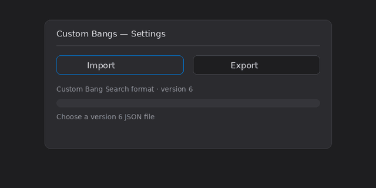

# Custom Bangs for Flow Launcher

A standalone Flow Launcher plugin for configurable DuckDuckGo-style bangs and multi-site search groups. Import and export use the same JSON format as the [Custom Bang Search](https://github.com/psidex/CustomBangSearch) browser extension, so lists can move between the two. Built for Flow Launcher 2.1.3+, .NET 9, and Windows 11.

## At a glance

| Capability | Example |
| --- | --- |
| No activator required | Type `yt guitar tutorial` directly |
| Optional activator | Choose any prefix, for example `!yt guitar tutorial` |
| Custom bangs | Map a command to one or more `%s` search URLs |
| Search groups | `shop1 headphones` opens the same search on Amazon, eBay, and AliExpress |
| List tools | Search, edit, multi-select, delete, reset, import, and export |

## Quick start

The default activator is empty, so commands work directly at the beginning of a Flow query:

```text
yt guitar tutorial
maps science museum
shop1 headphones
```

Set `!`, `?`, or any other prefix in the plugin settings if you prefer one. Existing settings are kept when the plugin is updated. Type `bangs settings` to open the settings page.



## Search groups

First create or import the individual shortcuts—for example `asd` for Amazon, `ede` for eBay, and `ali` for AliExpress. Select **+ Search group**, enter `shop1` as the group command and `asd, ede, ali` as its comma-separated members. Now `shop1 headphones` opens all three searches in the Windows default browser.

Groups stay above regular bangs in the list. They can only contain existing regular shortcuts, not missing shortcuts or other groups.



## Import and export

The plugin reads and writes the same version 6 JSON format as [Custom Bang Search](https://github.com/psidex/CustomBangSearch), the Chrome extension this plugin's bang format is modeled on ([Chrome Web Store listing](https://chromewebstore.google.com/detail/custom-bang-search/oobpkmpnffeacpnfbbepbdlhbfdejhpg?hl=en)); version 5 imports are also supported. This plugin itself has nothing to do with Chrome — the shared format just means a list can move between the two tools. Import replaces the current list after confirmation, so export a backup first.

Search groups use Flow's additional `groupMembers` field, which Custom Bang Search doesn't have and ignores on import.



### Ready-made list

[`tpdhd-custom-bangs-v6.json`](lists/tpdhd-custom-bangs-v6.json) (234 entries, including the `shop1` search group) starts from Custom Bang Search's own [Top 250 DuckDuckGo bang list](https://github.com/psidex/CustomBangSearch#lists), with these changes:

- All one-character shortcuts are removed, since with an empty activator they could intercept ordinary Flow searches.
- `cults`, `mmf`, `thangs`, and `thing` were added for 3D-print model search sites, and `mw` now points to MakerWorld instead of Merriam-Webster.
- The `shop1` search group was added, covering Amazon, eBay, and AliExpress.

[`lists/README.md`](lists/README.md) has more detail, plus links to Custom Bang Search's own ready-made DuckDuckGo Top 10–250 lists.

## Installation

Download `Flow.Launcher.Plugin.CustomBangs-<Version>.zip` from [Releases](https://github.com/tpdhd/Flow.Launcher.Plugin.CustomBangs/releases)—not the source ZIP. In Flow, install that ZIP as a local plugin (or run `pm install <absolute-path-to-zip>`), restart Flow, then open **Settings → Plugins → Custom Bangs**.

<details>
<summary>Compatibility and data format</summary>

Regular bangs keep the same fields as Custom Bang Search's version 6 format. A Flow search group adds `groupMembers`:

```json
{
  "version": 6,
  "bangs": [
    {
      "keyword": "shop1",
      "alias": null,
      "defaultUrl": "",
      "urls": [],
      "groupMembers": ["asd", "ede", "ali"],
      "dontEncodeQuery": false
    }
  ]
}
```

If a command has neither a query nor a valid `defaultUrl`, nothing opens. Queries are URL-encoded by default so spaces, umlauts, and special characters remain valid. **Don't encode query** is only for unusual templates that require raw text.

Imported aliases continue to resolve and can be edited. The current UI does not have a separate button for creating new aliases.

</details>

<details>
<summary>Curated starter list, build, and releases</summary>

The small project-owned starter catalog is [`curated-bangs.json`](src/Flow.Launcher.Plugin.CustomBangs/curated-bangs.json). It is loaded only during first initialization and restored by **Reset curated**. Optional files under [`lists/`](lists/) never overwrite an existing catalog automatically.

With the .NET 9 SDK installed on Windows, run `./build.ps1` to restore dependencies, build, test, and create an installable ZIP under `artifacts/`. CI builds and tests every push; a version tag creates a GitHub release.

</details>

## License

MIT. This is an independent implementation and does not copy source code from Custom Bang Search or Flow.Plugin.Bang.
